# INSTRUCTION

## HOMEPAGE

After users enter the app, they will immediately see the page. Users can click the provided buttons to enter further feature pages. The quickview of the page is showed below.

    <kbd>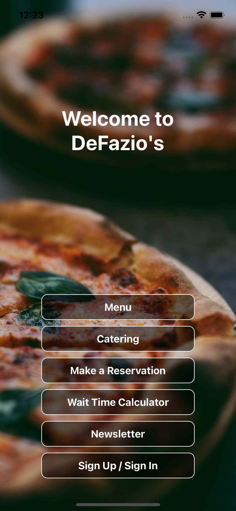</kbd>

## MENU

Users can view the menu and order food on the menu page. The first layer of the menu is for users to select the categories they are interested in.

<kbd>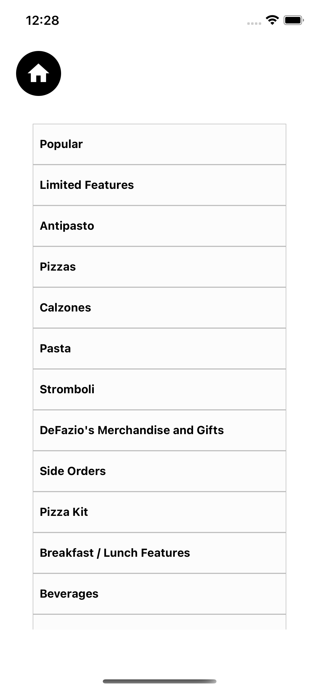</kbd>

After users select one category, they can see the food in the category.

<kbd>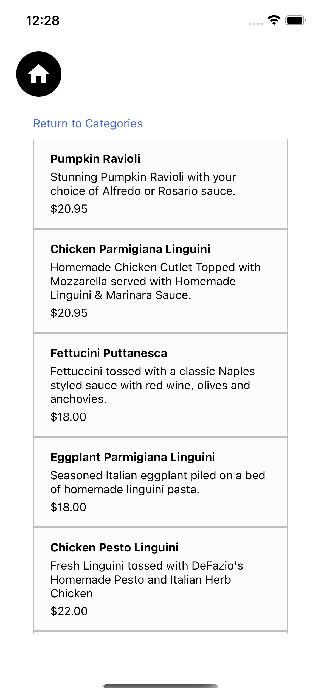</kbd>

By clicking the food button, users can add the food they selected into cart.

<kbd>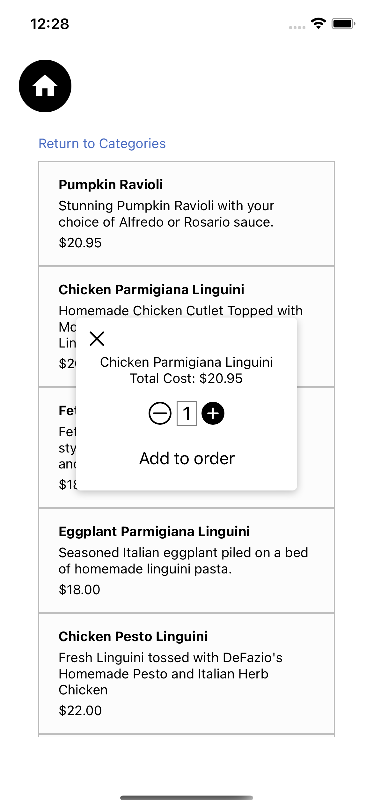</kbd>

## Catering

Users can see their previous orderes on the first layer, press `create new ordering page` for creating a new order

<kbd>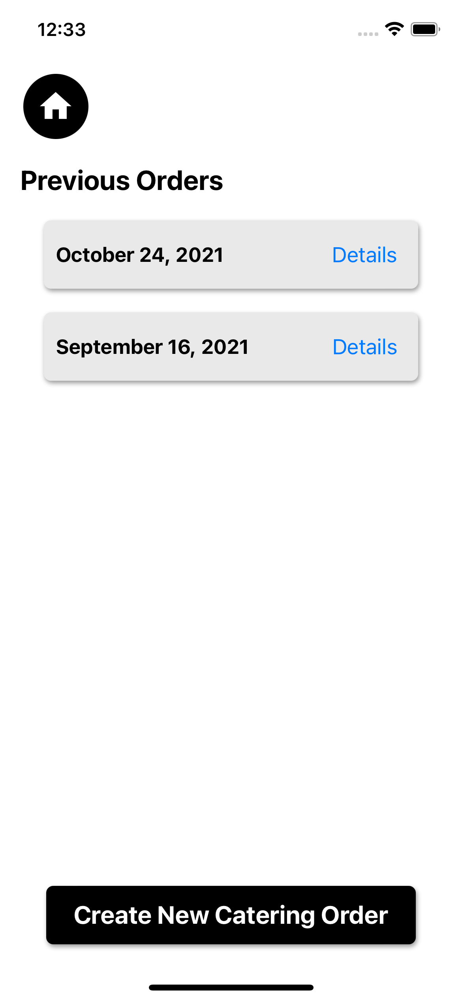</kbd>

After pressing `create new ordering page`, users will be offered the food that they can order

<kbd>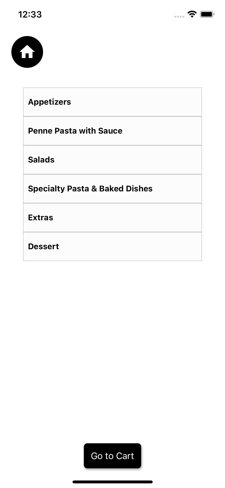</kbd>

After choosing the food, users will see the bill in advance, and start to choose time and enter personal info and payment method

<kbd>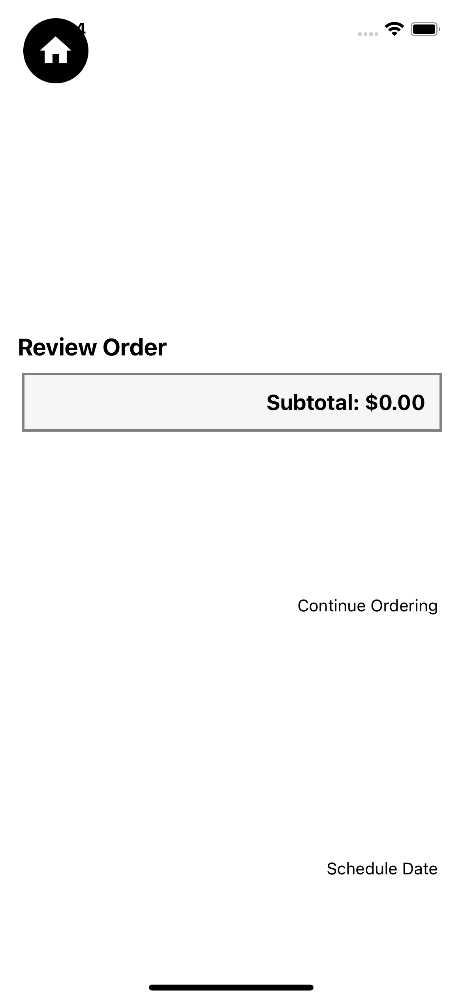</kbd>

<kbd>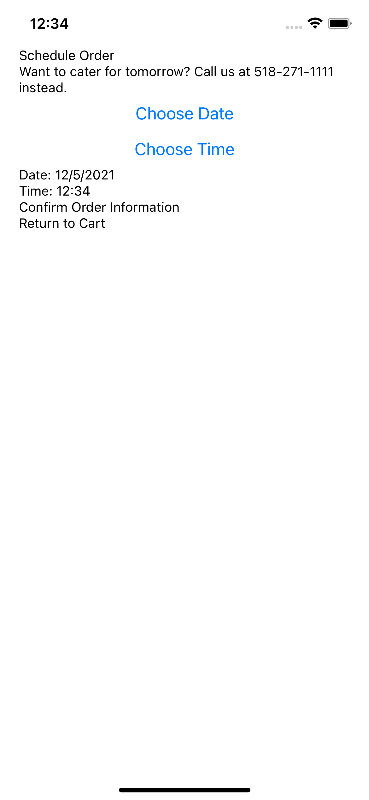</kbd>

<kbd>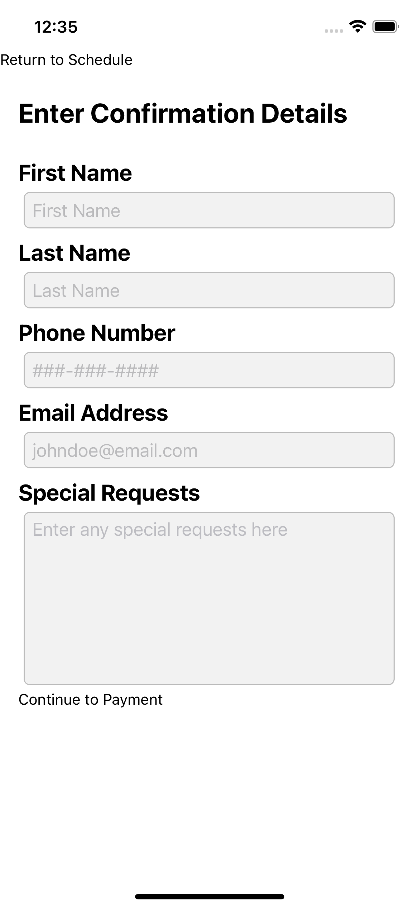</kbd>

<kbd>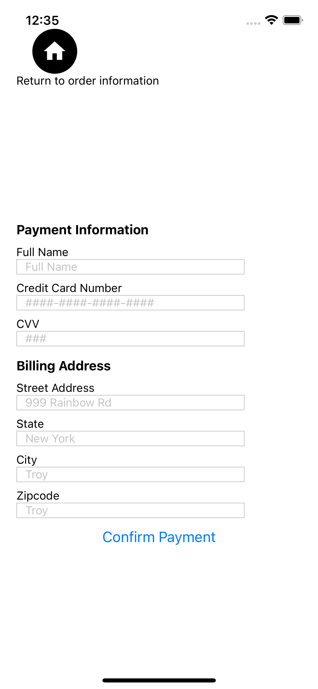</kbd>

Finally, a order confirmation will be provided

<kbd>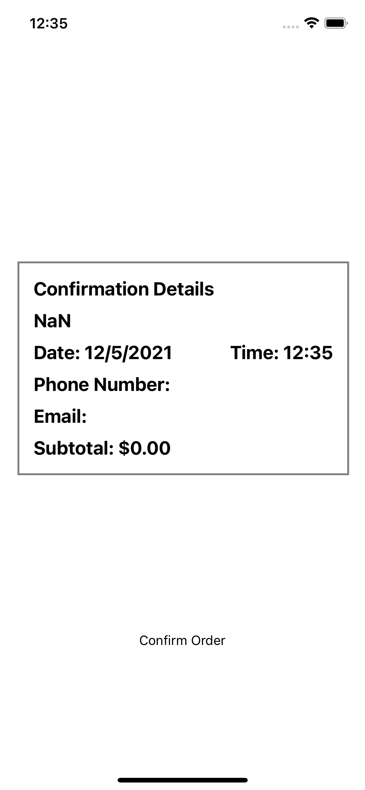</kbd>

## Wait Time Calculator

Users can see the wait time for their current orders.

<kbd>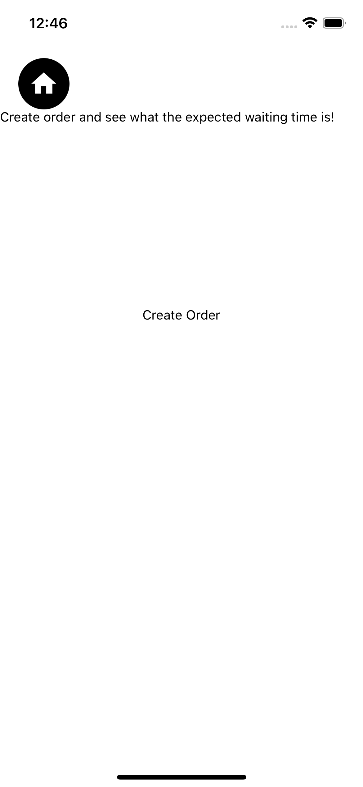</kbd>

